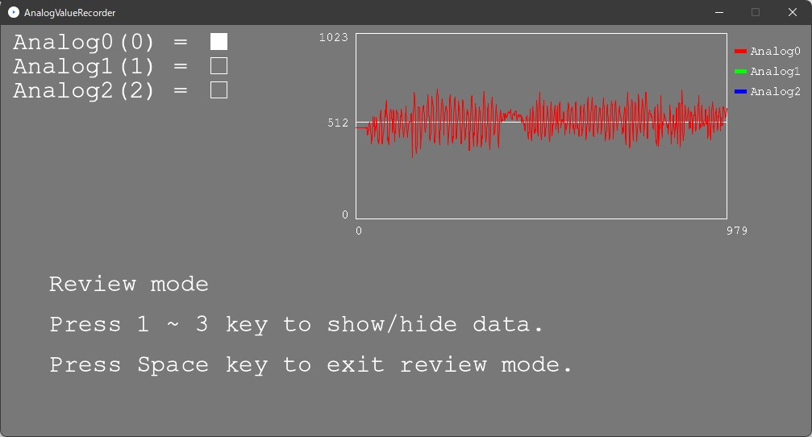

# AnalogValueRecorder
3KKで履修出来るK3004000「マイコン制御及び演習」で使用するアナログデータをcsvに書き出すプログラムです。

授業で提供される「Arduinoのアナログセンサの値をcsvファイルに保存する」プログラムを個人で改良したものです。既存の機能、
- Arduinoからのアナログの値を表示する。
- 表示される値を記録し、csvファイルとして保存する。

に加えて、
- 現在の記録時間を表示する。
- 直近10秒間（300ステップ、30ステップ/秒）のグラフを表示する。
- 入力ピンの追加・変更が容易（最大8ピン）。

という点を改良してあります。


ソースコード内の、

```java
/* --- Properties start --- */

String serialPort = ""; //Arduino serial port.
String fontFile = "CourierNewPSMT-48.vlw"; //Font file name.
int[] pins = {}; //Enter the pin number to record the analog input. The maximum number is 8.

/* --- Properties end --- */
```
の部分を適宜変更して使用して下さい。

## モード
### 記録モード
**スペースキー**を押して開始します。記録終了後に記録データをcsv形式で出力する通常モードです。

### 確認モード
**Cキー**を押して開始します。グラフ描画をしますが、記録データを出力しません。動作確認用のモードです。

### レビューモード
記録モードを終了した直後に**Rキー**を押して開始します。最後に記録したデータのグラフを表示します。数字キーの1~9（テンキーではない）を押すと各データを表示/非表示します。

